# Indicator Plots and Visualizations

This page showcases the variety of charts and plots generated from the trading indicators using real AAPL stock data.

## Candlestick Chart
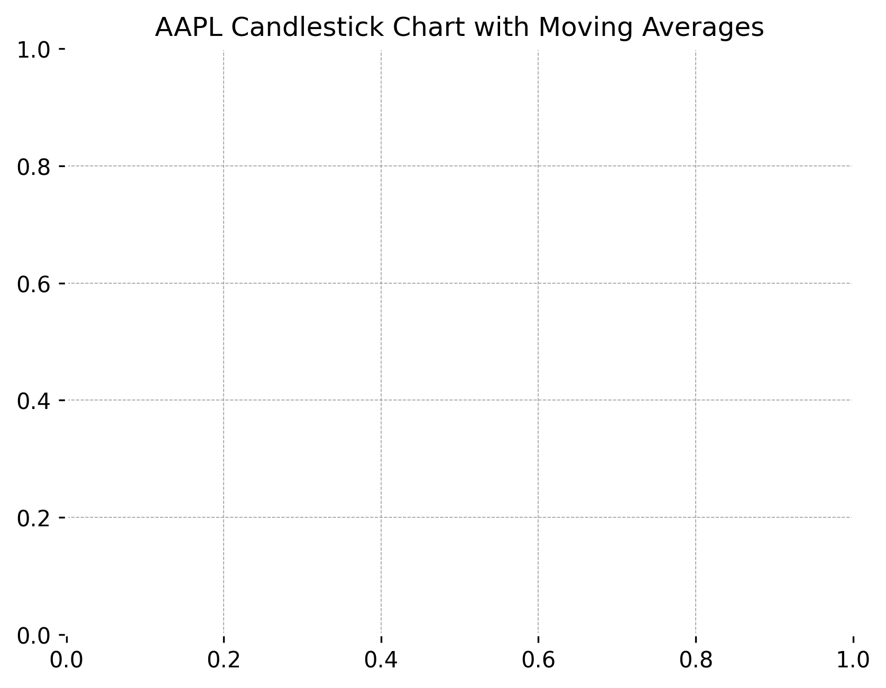

## Candlestick with Engulfing Patterns
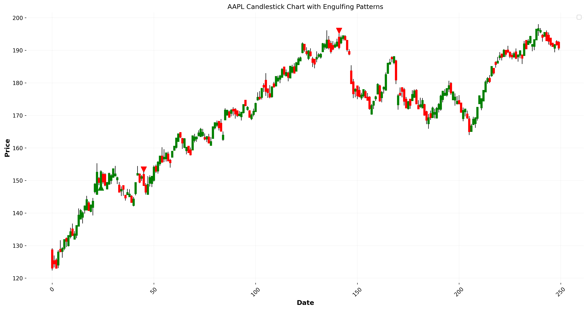

## Inside Bar Patterns
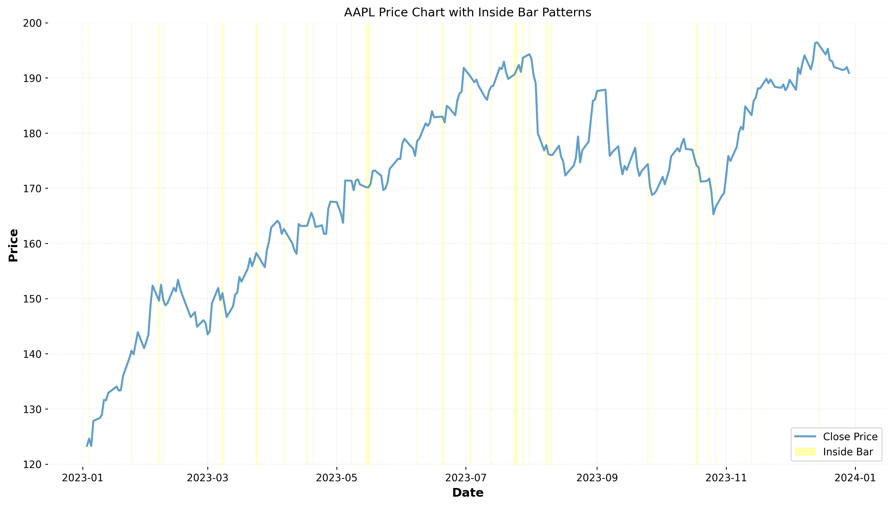

## Bollinger Bands with Force
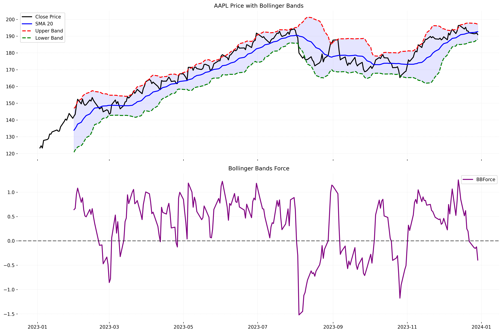

## MACD with Volume Weighting
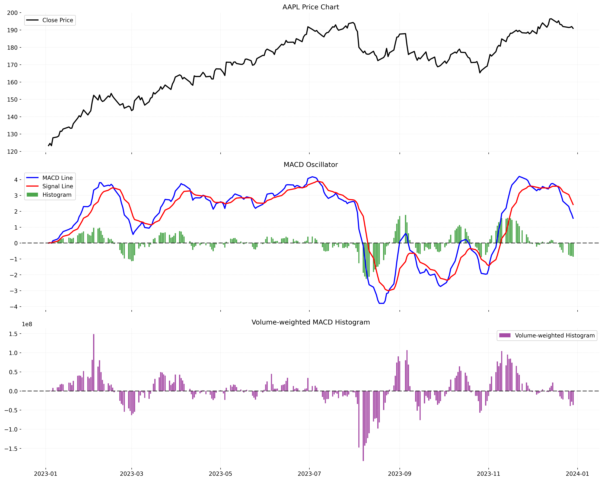

## ADX with Directional Indicators
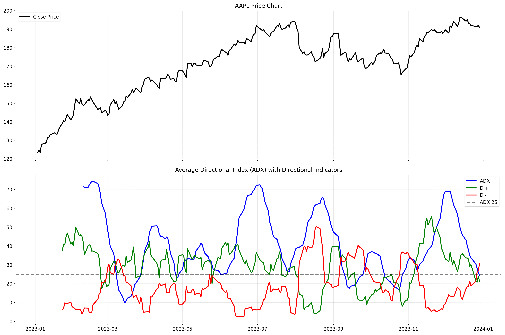

## Indicator Line Charts
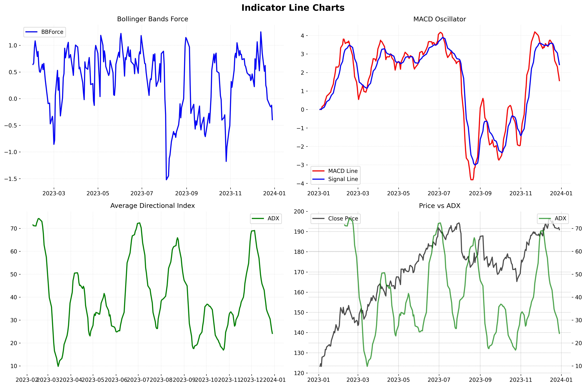

## Indicator Bar Charts
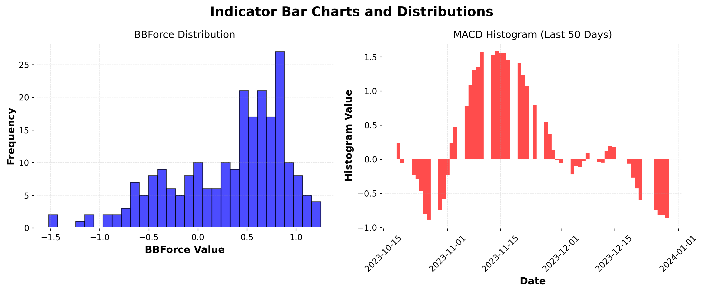

## Indicator Scatter Plots
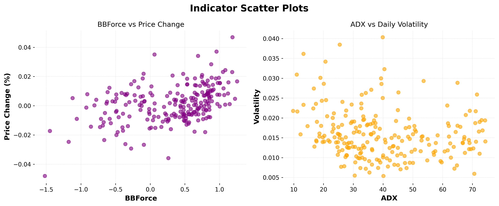

## Indicator Histograms
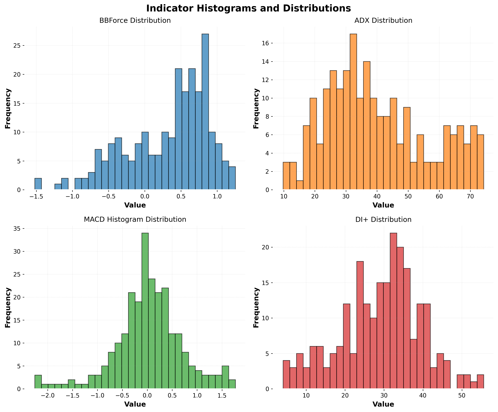

## Correlation Heatmap
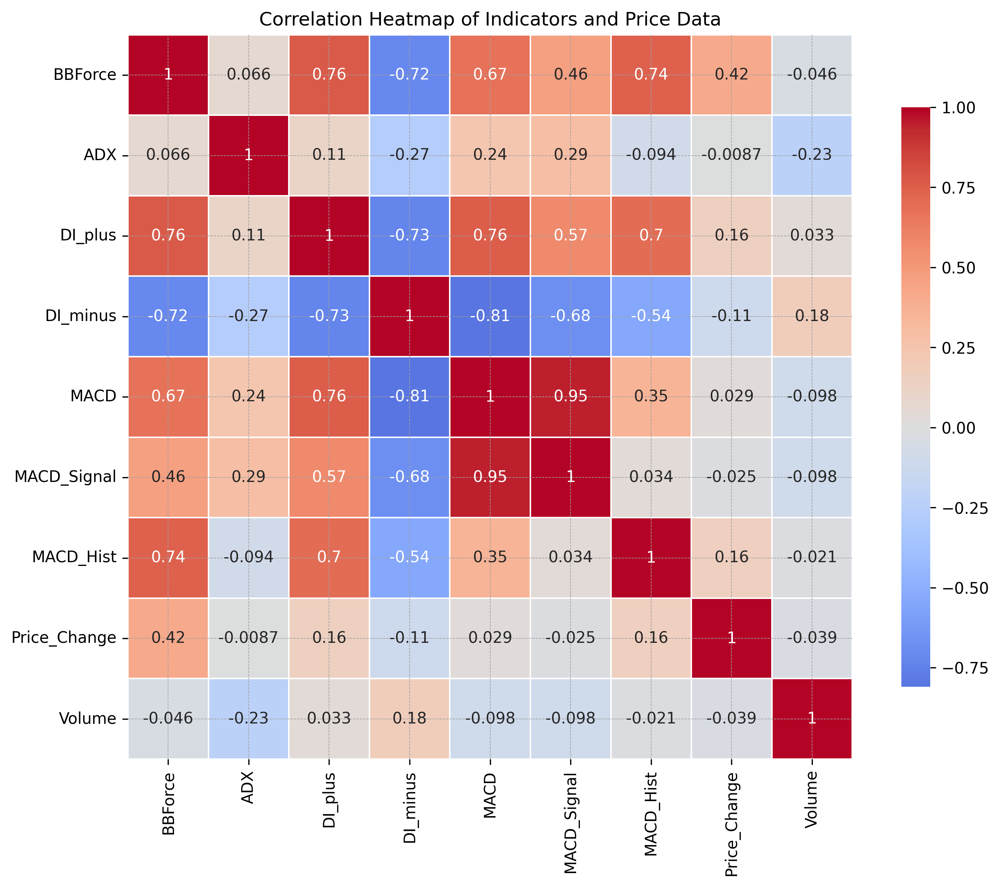

## Volume Analysis
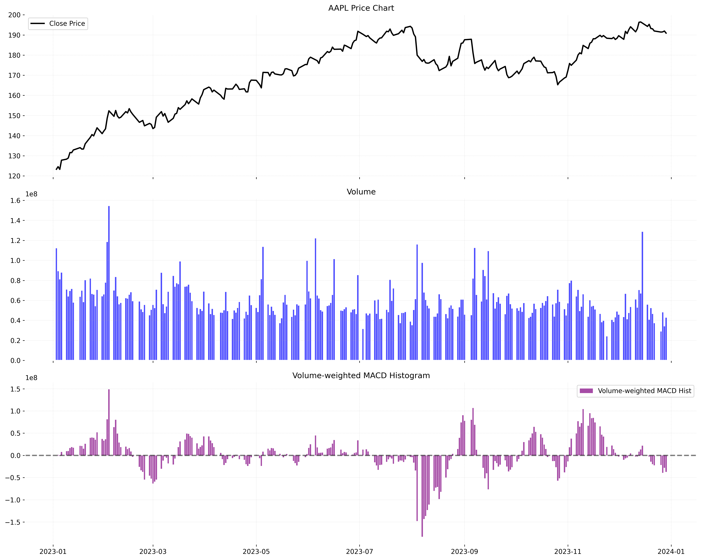